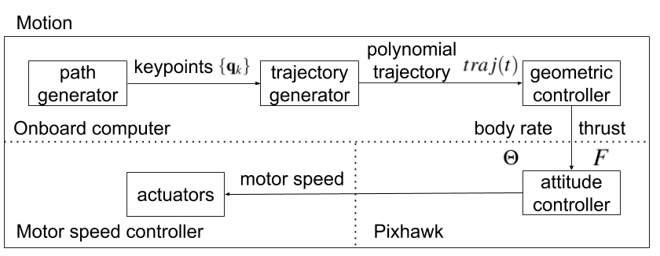

# uav_motion

This repository generates a minimum-snap polynomial trajectory and controls a quadrotor with PX4 framework. It depends on [ethz-asl/mav_trajectory_generation](https://github.com/ethz-asl/mav_trajectory_generation) and [Jaeyoung-Lim
/mavros_controllers](https://github.com/Jaeyoung-Lim/mavros_controllers).

[VIDEO DEMO](https://www.youtube.com/watch?v=CvvucGN3vZ0)


Give uav_motion a set of high-level waypoints, and it will do the remaining.

# Installation
1. ethz-asl/mav_trajectory_generation
```
cd ~/catkin_ws/src
git clone https://github.com/catkin/catkin_simple.git
git clone https://github.com/ethz-asl/eigen_catkin.git
git clone https://github.com/ethz-asl/eigen_checks.git
git clone https://github.com/ethz-asl/nlopt.git
git clone https://github.com/ethz-asl/glog_catkin.git
git clone https://github.com/ethz-asl/mav_comm.git
git clone https://github.com/ethz-asl/yaml_cpp_catkin.git
git clone https://github.com/ethz-asl/mav_trajectory_generation.git
cd ~/catkin_ws/
catkin build
```

2. Jaeyoung-Lim/mavros_controllers
```
cd ~/catkin_ws/src
git clone https://github.com/Jaeyoung-Lim/mavros_controllers.git
cd ~/catkin_ws/
catkin build
```


3. ZhiangChen/uav_motion
```
cd ~/catkin_ws/src
git clone https://github.com/ZhiangChen/uav_motion.git
cd ~/catkin_ws/
catkin build
```

# Getting Started
This gives you an example of using this package in gazebo. 

1. Launch a quadrotor with px4 and mavros in gazebo 
```
roslaunch px4 mavros_posix_sitl.launch
```
2. Define your keyframe waypoints in waypoint_generator.py and run the following commands
```
roslaunch uav_motion uav_motion.launch
rosrun uav_motion waypoint_generator.py
```

# ROS Nodes
### 1. trajectory_generator
Publishers:
- "path_segments": mav_planning_msgs::PolynomialTrajectory <sup>1</sup>
- "path_segments_4D": mav_planning_msgs::PolynomialTrajectory4D <sup>1</sup>

<sup>1</sup> Either will be remapped to "trajecotry" depending on if yaw is included in key waypoints.

Subscribers:
- "/reference/pose": geometry_msgs::PoseStamped
- "waypoints": uav_motion::waypointsGoal <sup>2</sup>

<sup>2</sup> It is a ROS action server.

Parameters:
- "mav_v": maximum velocity
- "mav_a": maximum acceleration
- "mav_ang_v": maximum angular velocity
- "mav_ang_a": maximum angular acceleration
- "current_ref_pose_as_start": the current reference pose will be included as the start point of trajectory if true

### 2. trajectory_sampler
Publishers:
- "reference/flatsetpoint": controller_msgs::FlatTarget
- "reference/yaw": std_msgs::Float32

Subscribers:
- "path_segments": mav_planning_msgs::PolynomialTrajectory <sup>1</sup>
- "path_segments_4D": mav_planning_msgs::PolynomialTrajectory4D <sup>1</sup>

Parameters:
- "dt": trajectory sampling rate

### 3. geometric_controller
Publishers:
- "/command/bodyrate_command" -> "/mavros/setpoint_raw/attitude": mavros_msgs::AttitudeTarget

Subscribers:
- "reference/flatsetpoint": controller_msgs::FlatTarget
- "reference/yaw": std_msgs::Float32

More information about this node can be found in [Jaeyoung-Lim
/mavros_controllers](https://github.com/Jaeyoung-Lim/mavros_controllers).

### 4. waypoint_generator.py
Publisher:
- "waypoints": uav_motion.msg.waypointsAction <sup>3</sup>

<sup>3</sup> It is a ROS action client.

# Parameter Tuning for Real UAV
Most of the parameters have been well tuned. However, when having a UAV with different mass, airframe, and battery, you need to pay extra attention to the following parameters in geometric_controller:
```
/geometric_controller/Kp_x
/geometric_controller/Kp_y
/geometric_controller/Kp_z
/geometric_controller/enable_gazebo_state
/geometric_controller/enable_sim
/geometric_controller/normalizedthrust_constant
/geometric_controller/normalizedthrust_offset

```
The first three parameters `Kp_z`, `Kp_y`, and `Kp_z` determines how responsive the UAV is following the reference pose. For example, if `Kp_z` is too large, there might be an overshoot problem on z-axis. `enable_gazebo_state` and `enable_sim` have to be set to false for real UAVs. The last two parameters `normalizedthrust_constant` and `normalizedthrust_offset` are determined by UAV mass, airframe, etc. When your UAV has a larger mass than Iris, you may need to increase `normalizedthrust_offset`. Otherwise, the UAV can't reach the desired elevation. When the battery is low, you may also need to increase normalizedthrust_offset. 

